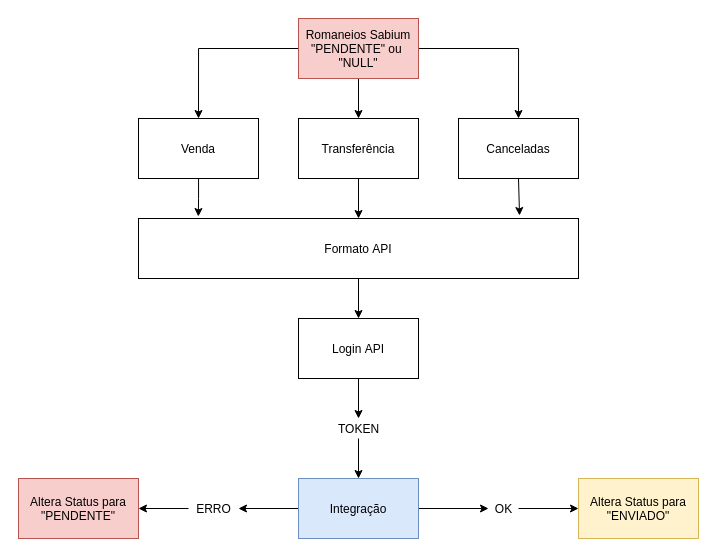

## Integração Confirma Fácil
> Integração de Notas de Venda, Transferência e Canceladas com a API do Confirma Fácil

### Resumo
> O Cron executa, busca as Notas no Sabium e envia para a API do Confirma Fácil. Após integração o número da nota e o número do romaneio são inseridas em uma tabela de log ```gazin.confirma_facil_integracao``` com o status 1 ```ENVIADA```. Dessa forma a rotina só irá buscar por notas status 2 ```PENDENTES```.

### Requisitos
- Node 14^
- Npm 6^

### Como executar
1. Instalar dependências
```sh
npm install
```

2. Executar em Produção / Desenvolvimento
```sh
npm start / npm run dev
```

### Fluxo
